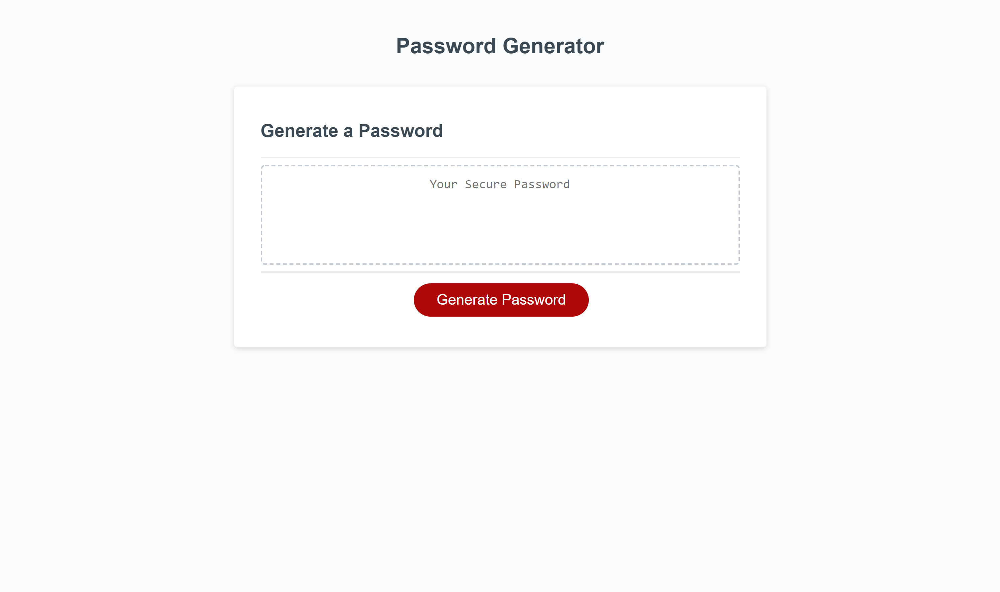

# Password-Generator

## The Importance of a Strong Password

    Strong passwords are utterly important – they prevent unauthorized access to your electronic accounts and devices.

    If you choose a very complicated and long password, you will make it very difficult for a hacker to crack it, whether by a brute-force attack (trying every possible combination of numbers, letters or special characters) or an automated machine attack trying thousands of combinations per second to guess your one and only.

    So, the more complex your password is, the more security it provides for your account. Remember that your account is where you store a great deal of sensitive information that you don’t want to have stolen. As you understand, the stakes are very high. Therefore, taking care of your account password is crucial.

    Credit to Namecheap.com for info on importance of a strong password. See link below for access to site where info was retrieved from. 
[Namecheap.com](https://www.namecheap.com/support/knowledgebase/article.aspx/9517/45/what-is-a-secure-password-and-why-is-it-important-to-have-one) 

## Description

    This week we were required to create an applicatoin that allows an employee to generate a random password based on criteria they've selected. We were given starter code that we were tasked to modify to dynamically update the HTML and CSS by the Javascript code that we had to write. Please see user story below to get an idea of what exactly our user was looking for us to help them with.
    
### User Story
```
AS AN employee with access to sensitive data
I WANT to randomly generate a password that meets certain criteria
SO THAT I can create a strong password that provides greater security
```

## Tasks Completed

    **List of Tasks Completed**

    1. Made Generate Password button functional so that when user clicks button they are prompted with criteria to select to create random password.

    2. Created variables for the different character types that the user will have the ability to chose from.

    3. Created additional variables in order for user input to be stored.

    4. Created generatePassword function which helped with prompting the user to select the desired criteria in order to create random password

    5. Created first prompt asking user to select a password length between 8 and 128 characters.

    6. Created an if statement alerting user to enter a number between 8 and 128, if their initial input was outside of those parameters.

    7. Created additional if statement that generates alert after input errors alerting user to click on generate password and try again.

    8. Created else statement asking user for confirmation on which character types they would like to include in their password. Choices are between numbers, special characters, uppercase letters, and lowercase letters.

    9. Created else if statements of all possible combinations of criteria selected in order to provide user a password with character set they requested.

    10. Finally, created for loop which would generate password based on selected criteria and publish it to the page for the user to easily access.

## Link to Deployed Application & Screenshots of Completed Application

    **Live Link**
[Password Generator](https://dspark8916.github.io/Password-Generator/)

    **ScreenShots**



